# Instalando, configurando e inicializando o Git no Windows

Para instalar o **Git** no Windows, [acesse o site oficial](https://git-scm.com/download/win).

Após baixar o **instalador** execute-o para **começar a instalação**.

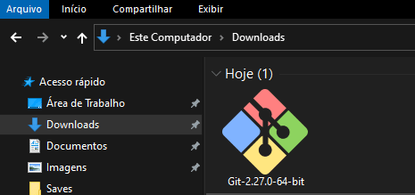

A primeira tela nos é apresentado os **termos da licença de utilização** do **Git**. 

Basta clicar em **Next**.

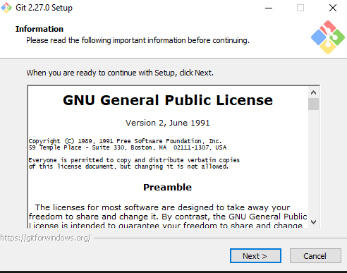

A tela seguinte é sobre o **local de instalação**. Você pode alterá-la, caso queira. Após definir o local da instalação, clique em **Next**.

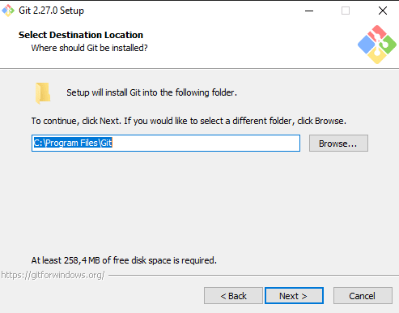

Na próxima tela, o instalador oferece a possibilidade de selecionar os **componentes** que queremos que seja instalado. Escolha os **componentes** de sua preferência e clique em **Next**.

Abaixo em exemplo de como prefiro os meus:

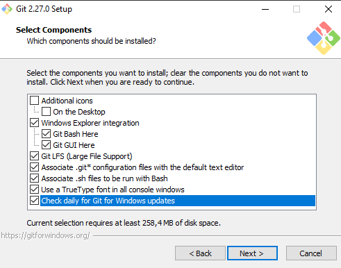

Em seguida o instalador nos indica que criará uma pasta com **atalhos** no **menu iniciar**. Aqui você pode fazer de acordo com a sua preferência. No meu caso eu deixei o instalador criar os atalhos.

Clique em **Next** para continuar a instalação.

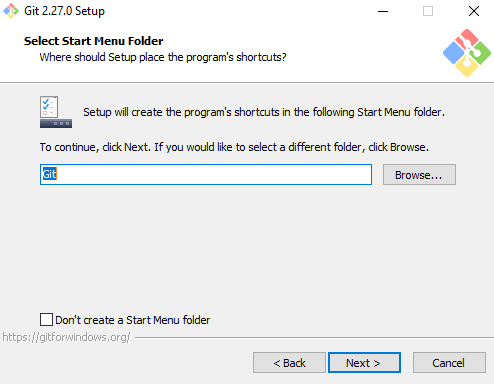

Na sequência, é pedido para selecionarmos o **editor de texto** que deve ser utilizado para editar os conflitos que ocorrerão. Aqui, eu aconselho a instalar seu editor preferido, antes da instalação do **Git** para que o instalador possa encontrá-lo. De todo modo, também é possível fazer a troca posteriormente.

Após a escolha, clique em **Next** para continuar.

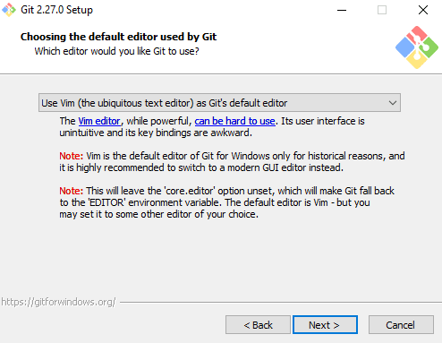

Em seguida, o instalador nos pergunta se queremos usar os comandos do **Git**:

- somente no prompt de comandos do próprio git (chamado de Git Bash), neste caso ele não vai alterar a variável de ambiente PATH.

- no **prompt do Windows** neste caso a variável de ambiente PATH será alterada para incluir o caminho onde está o executável do **Git**.

- no prompt do Windows e com os comandos utilitários do Linux. Aqui a variável de ambiente PATH será alterada para incluir o caminho do executável do **Git** e dos executáveis de cada comando utilitário do **Linux**.

Particularmente, prefiro essa última opção, porque o instalador traz para o **Windows** comandos que eu uso muito no terminal do **Linux**, como touch, cat, ls, etc. 

Escolha a opção que acha mais adequada para você e clique em **Next**.

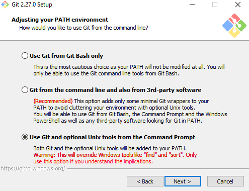

Na sequência, devemos escolher a biblioteca de **validação de chaves de segurança SSL**. Eu costumo utilizar a **OpenSSL**, que é compatível com outras plataformas.

Em seguida, clique em **Next**.

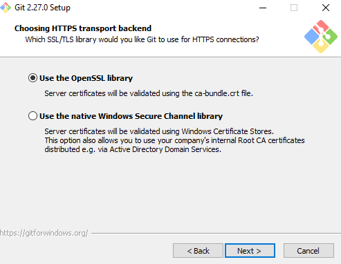

Aqui, o instalador nos pergunta como o **Git** deve tratar o final dos arquivos de texto. **Linux** e **Windows** tratam disso de formas diferentes. De maneira resumida, o **Linux** usa um caractere ASCII para a quebra de linha, enquanto o **Windows** usa dois.

Eu prefiro a primeira opção, para evitar problemas de compatibilidade.

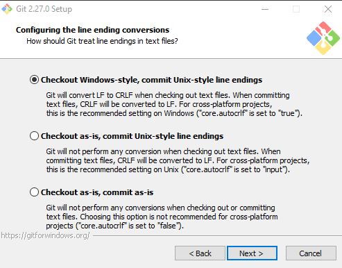

Na próxima tela, o instalador oferece a opção de escolher o emulador de terminal que queremos usar para o **Git**. Particularmente, acho melhor escolher o **MinTTY**, porque ele oferece alguns recursos melhores para terminal.

**Atenção aqui**: se  seu **Windows** for **32 bits** é melhor escolher o **cmd**.

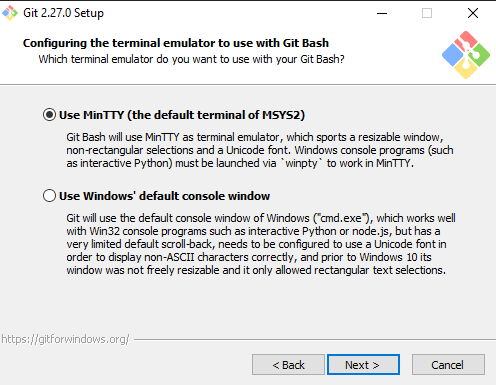

Na sequência devemos escolher o comportamento padrão de comando **git pull**. Eu preferi deixar marcada a primeira opção.

Em seguida, clique em **Next**.

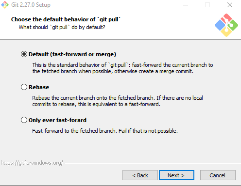

Estamos quase finalizando. Nessa tela temos algumas opções de:

- habilitar **cache de arquivos na memória**. Isso melhora o desempenho do **Git** em alguns casos.

- habilitar o gerenciador de credenciais do **Git**. Isso permite autenticação em duas etapas no **Github**.

- habilitar links simbólicos.

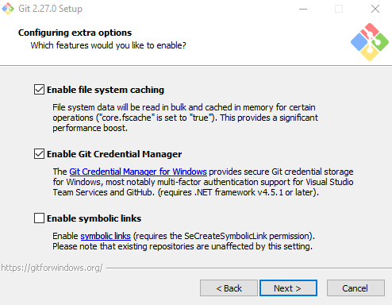

Por último, o instalador nos oferece alguns componentes que estão em fase de experimentação. Aqui fica totalmente a seu critério. Eu prefiro não instalá-los.

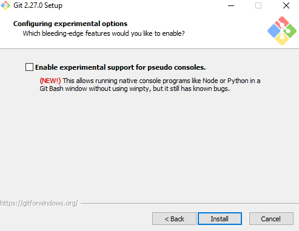

Então, clique em **Install** para começar a instalação.

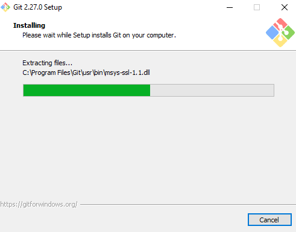

Depois da instalação, já podemos rodar o **Git Bash** e ver o arquivo de texto com as notas da versão lançada.

Para finalizar clique em **Finish**.

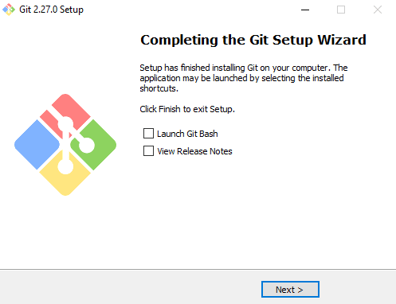

Agora você já pode versionar seus códigos no Windows! =D
